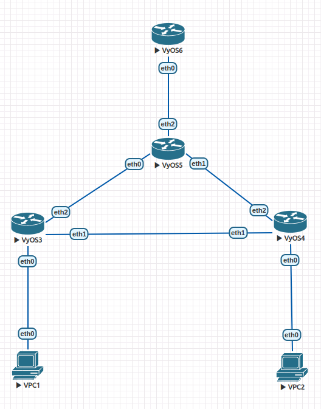

Конфигурации всех устройств будут ниже. Я привожу только конфигурации интерфейсов, потому что системные конфигурации я не трогал.

## Конфигурация клиента и результат пинга
### VPC1
```
VPCS> show ip

NAME        : VPCS[1]
IP/MASK     : 10.0.10.1/24
GATEWAY     : 10.0.10.13
DNS         : 
MAC         : 00:50:79:66:68:01
LPORT       : 20000
RHOST:PORT  : 127.0.0.1:30000
MTU         : 1500

VPCS> ping 10.0.20.1

84 bytes from 10.0.20.1 icmp_seq=1 ttl=63 time=14.569 ms
84 bytes from 10.0.20.1 icmp_seq=2 ttl=63 time=17.472 ms
84 bytes from 10.0.20.1 icmp_seq=3 ttl=63 time=17.962 ms
84 bytes from 10.0.20.1 icmp_seq=4 ttl=63 time=11.755 ms
84 bytes from 10.0.20.1 icmp_seq=5 ttl=63 time=9.121 ms
```
### VPC2
```
VPCS> show ip

NAME        : VPCS[1]
IP/MASK     : 10.0.20.1/24
GATEWAY     : 10.0.20.13
DNS         : 
MAC         : 00:50:79:66:68:02
LPORT       : 20000
RHOST:PORT  : 127.0.0.1:30000
MTU         : 1500

VPCS> ping 10.0.10.1

84 bytes from 10.0.10.1 icmp_seq=1 ttl=63 time=11.164 ms
84 bytes from 10.0.10.1 icmp_seq=2 ttl=63 time=3.604 ms
84 bytes from 10.0.10.1 icmp_seq=3 ttl=63 time=8.724 ms
84 bytes from 10.0.10.1 icmp_seq=4 ttl=63 time=9.006 ms
84 bytes from 10.0.10.1 icmp_seq=5 ttl=63 time=3.554 ms
```
## Конфигурация маршрутизатора (VyOS6)

```
interfaces {
    ethernet eth0 {
        hw-id 50:00:00:06:00:00
        vif 10 {
            address 10.0.10.13/24
        }
        vif 20 {
            address 10.0.20.13/24
        }
    }
    ethernet eth1 {
        hw-id 50:00:00:06:00:01
    }
    ethernet eth2 {
        hw-id 50:00:00:06:00:02
    }
    ethernet eth3 {
        hw-id 50:00:00:06:00:03
    }
    loopback lo {
    }
}
```
## Конфигурация коммутатора (VyOS5)
```
interfaces {
    bridge br0 {
        enable-vlan
        member {
            interface eth0 {
                allowed-vlan 10
            }
            interface eth1 {
                allowed-vlan 20
            }
            interface eth2 {
                allowed-vlan 20
                allowed-vlan 10
            }
        }
        stp
    }
    ethernet eth0 {
        hw-id 50:00:00:05:00:00
    }
    ethernet eth1 {
        hw-id 50:00:00:05:00:01
    }
    ethernet eth2 {
        hw-id 50:00:00:05:00:02
    }
    ethernet eth3 {
        hw-id 50:00:00:05:00:03
    }
    loopback lo {
    }
}
```
## Конфигурация коммутатора (VyOS3)
```
interfaces {
    bridge br0 {
        enable-vlan
        member {
            interface eth0 {
                allowed-vlan 10
                native-vlan 10
            }
            interface eth1 {
                cost 1000
            }
            interface eth2 {
                allowed-vlan 10
            }
        }
        stp
    }
    ethernet eth0 {
        hw-id 50:00:00:03:00:00
    }
    ethernet eth1 {
        hw-id 50:00:00:03:00:01
    }
    ethernet eth2 {
        hw-id 50:00:00:03:00:02
    }
    ethernet eth3 {
        hw-id 50:00:00:03:00:03
    }
    loopback lo {
    }
}
```
## Конфигурация коммутатора (VyOS4)
```
interfaces {
    bridge br0 {
        enable-vlan
        member {
            interface eth0 {
                allowed-vlan 20
                native-vlan 20
            }
            interface eth1 {
                cost 1000
            }
            interface eth2 {
                allowed-vlan 20
            }
        }
        stp
    }
    ethernet eth0 {
        hw-id 50:00:00:04:00:00
    }
    ethernet eth1 {
        hw-id 50:00:00:04:00:01
    }
    ethernet eth2 {
        hw-id 50:00:00:04:00:02
    }
    ethernet eth3 {
        hw-id 50:00:00:04:00:03
    }
    loopback lo {
    }
}
```

## Вывод stp на VyOS4
```
vyos@vyos:~$ show bridge br0 spanning-tree
br0
 bridge id              8000.500000040000
 designated root        8000.500000030000
 root port                 3                    path cost                200
 max age                  20.00                 bridge max age            20.00
 hello time                2.00                 bridge hello time          2.00
 forward delay            14.00                 bridge forward delay      14.00
 ageing time             300.00
 hello timer               0.00                 tcn timer                  0.00
 topology change timer     0.00                 gc timer                 223.87
 flags                  

eth0 (1)
 port id                8001                    state                forwarding
 designated root        8000.500000030000       path cost                100
 designated bridge      8000.500000040000       message age timer          0.00
 designated port        8001                    forward delay timer        0.00
 designated cost         200                    hold timer                 0.61
 flags                  

eth1 (2)
 port id                8002                    state                  blocking
 designated root        8000.500000030000       path cost               1000
 designated bridge      8000.500000030000       message age timer         19.60
 designated port        8002                    forward delay timer        0.00
 designated cost           0                    hold timer                 0.00
 flags                  

eth2 (3)
 port id                8003                    state                forwarding
 designated root        8000.500000030000       path cost                100
 designated bridge      8000.500000050000       message age timer         19.60
 designated port        8002                    forward delay timer        0.00
 designated cost         100                    hold timer                 0.00
 flags  
```