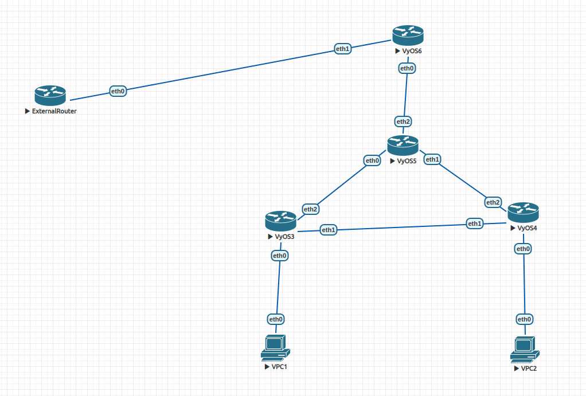

В конфигурации коммутатора ничего не поменялось с прошлого раза, так что приведу только конфигурации клиентов и маршрутизаторов.

Адрес внешнего маршрутизатора - `15.43.15.44/24`, адрес порта внутреннего маршрутизатора, соединённого с ним - `15.43.15.43/24`. Не знаю, как ещё прокомментировать.


## Клиент в подсети VLAN10
```
VPCS> ip dhcp
DDORA IP 10.0.10.11/24 GW 10.0.10.1

VPCS> ping 10.0.20.10

84 bytes from 10.0.20.10 icmp_seq=1 ttl=63 time=14.469 ms
84 bytes from 10.0.20.10 icmp_seq=2 ttl=63 time=9.942 ms
84 bytes from 10.0.20.10 icmp_seq=3 ttl=63 time=3.715 ms
84 bytes from 10.0.20.10 icmp_seq=4 ttl=63 time=6.909 ms
84 bytes from 10.0.20.10 icmp_seq=5 ttl=63 time=3.509 ms

VPCS> ping 15.43.15.44

84 bytes from 15.43.15.44 icmp_seq=1 ttl=63 time=5.689 ms
84 bytes from 15.43.15.44 icmp_seq=2 ttl=63 time=5.086 ms
84 bytes from 15.43.15.44 icmp_seq=3 ttl=63 time=6.284 ms
84 bytes from 15.43.15.44 icmp_seq=4 ttl=63 time=20.681 ms
84 bytes from 15.43.15.44 icmp_seq=5 ttl=63 time=5.442 ms
```
## Клиент в подсети VLAN20
Я здесь случайно пропинговал не компьютер в другой подсети, а роутер другой подсети, но не суть важно.
```
VPCS> ip dhcp
DDORA IP 10.0.20.10/24 GW 10.0.20.1

VPCS> ping 10.0.10.1

84 bytes from 10.0.10.1 icmp_seq=1 ttl=64 time=3.414 ms
84 bytes from 10.0.10.1 icmp_seq=2 ttl=64 time=4.400 ms
84 bytes from 10.0.10.1 icmp_seq=3 ttl=64 time=4.633 ms
84 bytes from 10.0.10.1 icmp_seq=4 ttl=64 time=4.288 ms
84 bytes from 10.0.10.1 icmp_seq=5 ttl=64 time=4.840 ms

VPCS> ping 15.43.15.44

84 bytes from 15.43.15.44 icmp_seq=1 ttl=63 time=6.822 ms
84 bytes from 15.43.15.44 icmp_seq=2 ttl=63 time=7.099 ms
84 bytes from 15.43.15.44 icmp_seq=3 ttl=63 time=6.017 ms
84 bytes from 15.43.15.44 icmp_seq=4 ttl=63 time=10.911 ms
84 bytes from 15.43.15.44 icmp_seq=5 ttl=63 time=6.531 ms
```
## Внешний маршрутизатор (ExternalRouter)
```
interfaces {
    ethernet eth0 {
        address 15.43.15.44/24
        hw-id 50:00:00:07:00:00
    }
    ethernet eth1 {
        hw-id 50:00:00:07:00:01
    }
    ethernet eth2 {
        hw-id 50:00:00:07:00:02
    }
    ethernet eth3 {
        hw-id 50:00:00:07:00:03
    }
    loopback lo {
    }
}
```
## Маршрутизатор (VyOS6)
```
interfaces {
    ethernet eth0 {
        hw-id 50:00:00:06:00:00
        vif 10 {
            address 10.0.10.1/24
        }
        vif 20 {
            address 10.0.20.1/24
        }
    }
    ethernet eth1 {
        address 15.43.15.43/24
        hw-id 50:00:00:06:00:01
    }
    ethernet eth2 {
        hw-id 50:00:00:06:00:02
    }
    ethernet eth3 {
        hw-id 50:00:00:06:00:03
    }
    loopback lo {
    }
}
nat {
    source {
        rule 20 {
            outbound-interface eth1
            source {
            }
            translation {
                address 15.43.15.43
            }
        }
    }
}
protocols {
    static {
        route 0.0.0.0/0 {
            next-hop 1.0.0.1 {
            }
        }
    }
}
service {
    dhcp-server {
        shared-network-name VLAN10 {
            subnet 10.0.10.0/24 {
                default-router 10.0.10.1
                name-server 10.0.10.1
                range 0 {
                    start 10.0.10.10
                    stop 10.0.10.254
                }
            }
        }
        shared-network-name VLAN20 {
            subnet 10.0.20.0/24 {
                default-router 10.0.20.1
                name-server 10.0.20.1
                range 0 {
                    start 10.0.20.10
                    stop 10.0.20.254
                }
            }
        }
    }
}
```