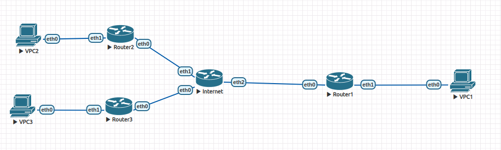

Вот схема конфигурации нод. Я настроил общение VPC1 и VPC2 через GRE, VPC1 и VPC3 через IPSEC + GRE.



## VPC 1
```
VPCS> show

NAME   IP/MASK              GATEWAY                             GATEWAY
VPCS1  0.0.1.2/24           0.0.1.1
       fe80::250:79ff:fe66:6805/64

VPCS> ping 0.0.2.2

84 bytes from 0.0.2.2 icmp_seq=1 ttl=62 time=6.772 ms
84 bytes from 0.0.2.2 icmp_seq=2 ttl=62 time=4.596 ms
84 bytes from 0.0.2.2 icmp_seq=3 ttl=62 time=4.588 ms
84 bytes from 0.0.2.2 icmp_seq=4 ttl=62 time=4.243 ms
84 bytes from 0.0.2.2 icmp_seq=5 ttl=62 time=4.067 ms

VPCS> ping 0.0.3.2

84 bytes from 0.0.3.2 icmp_seq=1 ttl=62 time=349.912 ms
84 bytes from 0.0.3.2 icmp_seq=2 ttl=62 time=468.162 ms
84 bytes from 0.0.3.2 icmp_seq=3 ttl=62 time=6.117 ms
84 bytes from 0.0.3.2 icmp_seq=4 ttl=62 time=7.362 ms
84 bytes from 0.0.3.2 icmp_seq=5 ttl=62 time=4.618 ms
```
## VPC 2
```
VPCS> show

NAME   IP/MASK              GATEWAY                             GATEWAY
VPCS1  0.0.2.2/24           0.0.2.1
       fe80::250:79ff:fe66:6806/64

VPCS> ping 0.0.1.2

84 bytes from 0.0.1.2 icmp_seq=1 ttl=62 time=3.485 ms
84 bytes from 0.0.1.2 icmp_seq=2 ttl=62 time=2.786 ms
84 bytes from 0.0.1.2 icmp_seq=3 ttl=62 time=2.461 ms
84 bytes from 0.0.1.2 icmp_seq=4 ttl=62 time=2.956 ms
84 bytes from 0.0.1.2 icmp_seq=5 ttl=62 time=3.443 ms
```
## VPC 3
```
VPCS> show

NAME   IP/MASK              GATEWAY                             GATEWAY
VPCS1  0.0.3.2/24           0.0.3.1
       fe80::250:79ff:fe66:6807/64

VPCS> ping 0.0.1.2

84 bytes from 0.0.1.2 icmp_seq=1 ttl=62 time=5.337 ms
84 bytes from 0.0.1.2 icmp_seq=2 ttl=62 time=2.698 ms
84 bytes from 0.0.1.2 icmp_seq=3 ttl=62 time=2.683 ms
84 bytes from 0.0.1.2 icmp_seq=4 ttl=62 time=3.257 ms
84 bytes from 0.0.1.2 icmp_seq=5 ttl=62 time=2.357 ms
```
## Internet
```
interfaces {
    ethernet eth0 {
        address 3.0.0.1/24
        hw-id 50:00:00:01:00:00
    }
    ethernet eth1 {
        address 2.0.0.1/24
        hw-id 50:00:00:01:00:01
    }
    ethernet eth2 {
        address 1.0.0.1/24
        hw-id 50:00:00:01:00:02
    }
    ethernet eth3 {
        hw-id 50:00:00:01:00:03
    }
    loopback lo {
    }
}
protocols {
    static {
        route 1.0.0.0/24 {
            next-hop 1.0.0.2 {
            }
        }
        route 2.0.0.0/24 {
            next-hop 2.0.0.2 {
            }
        }
        route 3.0.0.0/24 {
            next-hop 3.0.0.2 {
            }
        }
    }
}
```
## Router 1
```
interfaces {
    ethernet eth0 {
        address 1.0.0.2/24
        hw-id 50:00:00:03:00:00
    }
    ethernet eth1 {
        address 0.0.1.1/24
        hw-id 50:00:00:03:00:01
    }
    ethernet eth2 {
        hw-id 50:00:00:03:00:02
    }
    ethernet eth3 {
        hw-id 50:00:00:03:00:03
    }
    loopback lo {
    }
    tunnel tun0 {
        address 42.0.0.1/30
        encapsulation gre
        remote 2.0.0.2
        source-address 1.0.0.2
    }
    tunnel tun1 {
        address 43.0.0.1/30
        encapsulation gre
        remote 3.0.0.2
        source-address 1.0.0.2
    }
}
protocols {
    static {
        route 0.0.0.0/0 {
            next-hop 1.0.0.1 {
            }
        }
        route 0.0.2.0/24 {
            next-hop 42.0.0.2 {
            }
        }
        route 0.0.3.0/24 {
            next-hop 43.0.0.2 {
            }
        }
    }
}
vpn {
    ipsec {
        esp-group central-rtr-esp {
            compression disable
            lifetime 1800
            mode tunnel
            pfs enable
            proposal 1 {
                encryption aes256
                hash sha256
            }
        }
        ike-group central-rtr-ike {
            ikev2-reauth no
            key-exchange ikev1
            lifetime 3600
            proposal 1 {
                encryption aes256
                hash sha256
            }
        }
        ipsec-interfaces {
            interface eth0
        }
        site-to-site {
            peer 3.0.0.2 {
                authentication {
                    mode pre-shared-secret
                    pre-shared-secret ****************
                }
                default-esp-group central-rtr-esp
                ike-group central-rtr-ike
                local-address 1.0.0.2
                tunnel 0 {
                    protocol gre
                }
            }
        }
    }
}
```
## Router 2
```
interfaces {
    ethernet eth0 {
        address 2.0.0.2/24
        hw-id 50:00:00:02:00:00
    }
    ethernet eth1 {
        address 0.0.2.1/24
        hw-id 50:00:00:02:00:01
    }
    ethernet eth2 {
        hw-id 50:00:00:02:00:02
    }
    ethernet eth3 {
        hw-id 50:00:00:02:00:03
    }
    loopback lo {
    }
    tunnel tun0 {
        address 42.0.0.1/30
        encapsulation gre
        remote 1.0.0.2
        source-address 2.0.0.2
    }
}
protocols {
    static {
        route 0.0.0.0/0 {
            next-hop 2.0.0.1 {
            }
        }
        route 0.0.1.0/24 {
            next-hop 42.0.0.2 {
            }
        }
    }
}
```
## Router 3
```
interfaces {
    ethernet eth0 {
        address 3.0.0.2/24
        hw-id 50:00:00:04:00:00
    }
    ethernet eth1 {
        address 0.0.3.1/24
        hw-id 50:00:00:04:00:01
    }
    ethernet eth2 {
        hw-id 50:00:00:04:00:02
    }
    ethernet eth3 {
        hw-id 50:00:00:04:00:03
    }
    loopback lo {
    }
    tunnel tun0 {
        address 42.0.0.1/30
        encapsulation gre
        remote 1.0.0.2
        source-address 3.0.0.2
    }
}
protocols {
    static {
        route 0.0.0.0/0 {
            next-hop 3.0.0.1 {
            }
        }
        route 0.0.1.0/24 {
            next-hop 42.0.0.2 {
            }
        }
    }
}
vpn {
    ipsec {
        esp-group central-rtr-esp {
            compression disable
            lifetime 1800
            mode tunnel
            pfs enable
            proposal 1 {
                encryption aes256
                hash sha256
            }
        }
        ike-group central-rtr-ike {
            ikev2-reauth no
            key-exchange ikev1
            lifetime 3600
            proposal 1 {
                encryption aes256
                hash sha256
            }
        }
        ipsec-interfaces {
            interface eth0
        }
        site-to-site {
            peer 1.0.0.2 {
                authentication {
                    mode pre-shared-secret
                    pre-shared-secret ****************
                }
                default-esp-group central-rtr-esp
                ike-group central-rtr-ike
                local-address 3.0.0.2
                tunnel 0 {
                    protocol gre
                }
            }
        }
    }
}
```